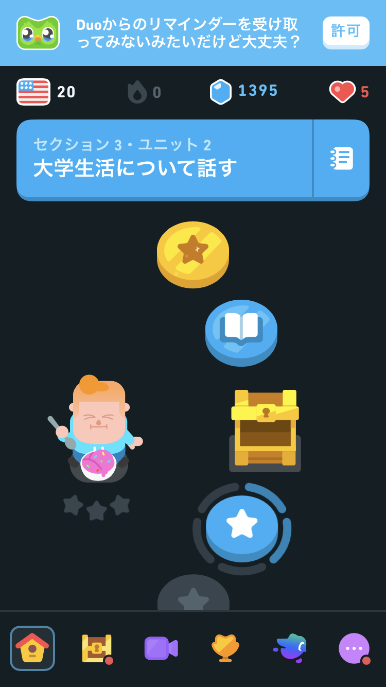

# 要求仕様書

## 目的

発音矯正アプリを開発すること

## 背景

現代的なコロケーションを教材とした発音矯正のアプリケーションを開発することで、CEFRB1の学習者が最速で「喋れる」「聞き取れる」を達成すること。

## 画面

ホーム画面：コースの進捗状況を表示し、切り替えでIPA発音記号一覧を表示します。練習した発音記号は緑色、発音したことのある発音記号は青色で表示し、各発音記号には練習の平均スコアを表示します。
ユニット画面：選択したユニットの発音記号の発音方法を説明します。
練習画面：発音記号の発音を練習し、スコアに応じてフィードバックを表示します（例: Nice!、Good!、Super!）。
完了画面：練習が完了したことを示すお祝いメッセージを表示します。

## 機能要件

### 前提

開発する際はlinkloop2/frontendディレクトリを参照する。
同じnextjsを利用しているためほぼ流用できると考えている。

### ホーム画面関連

- 画面上部に2つの表示パターンを行き来できるタブボタンを用意する
- 1つ目のパターン：duolingoのホーム画面のようにコース進捗を表示する
- コース進捗のユニットをタップするとユニット画面に飛ぶ

 

- 2つ目のパターン：切り替えでIPA発音記号一覧を表示。練習した発音記号は緑色、発音したことのある発音記号は青色で表示し、各発音記号には練習の平均スコアを表示。

### ユニット画面関連

- 選択したユニットの発音記号の発音方法に関する動画をながす
- この動画とインタラクティブに会話できるようにする
- 動画ファイルはfrontend/publicの下にあるmp4ファイルを利用する
- 動画が完了したら「次へ」ボタンを押すと練習画面に飛ぶようにする

### 練習画面関連

- 発音練習のフレーズはdocs/expressions_with_ipa_flags.csvから該当する単語と紐付けて持ってくる
- 今回はrとlのみに絞って5つほど練習する
- 文1つごとに
　・発音評価
　・評価スコアが70より下ならNice!、70以上90より下ならGood!、90以上ならSuper!と表示する
　・レスポンスをそのままデータベースに保存する
- 評価が完了したら次の画面に遷移する
- 文が5つ完了したら完了画面に遷移する

### 完了画面関連

- 練習が完了したことを示すお祝いメッセージを表示する
- ホーム画面にリダイレクトする

### 補足

- ユーザーの練習レスポンスは下記のように戻る

```json
{
  "Id": "4e27dfe32a1a4d6d92e0c07e9a4bcccd",
  "RecognitionStatus": "Success",
  "Offset": 7500000,
  "Duration": 800000,
  "Channel": 0,
  "DisplayText": "Light.",
  "SNR": 22.248325,
  "NBest": [
    {
      "Confidence": 0.6068662,
      "Lexical": "light",
      "ITN": "light",
      "MaskedITN": "light",
      "Display": "Light.",
      "PronunciationAssessment": {
        "AccuracyScore": 0,
        "FluencyScore": 0,
        "ProsodyScore": 13.1,
        "CompletenessScore": 0,
        "PronScore": 2.6
      },
      "Words": [
        {
          "Word": "light",
          "Offset": 7500000,
          "Duration": 800000,
          "PronunciationAssessment": {
            "AccuracyScore": 0,
            "ErrorType": "Mispronunciation",
            "Feedback": {
              "Prosody": {
                "Break": {
                  "ErrorTypes": [
                    "None"
                  ],
                  "BreakLength": 0
                },
                "Intonation": {
                  "ErrorTypes": [],
                  "Monotone": {
                    "SyllablePitchDeltaConfidence": 0.50218755
                  }
                }
              }
            }
          },
          "Syllables": [
            {
              "Syllable": "layt",
              "Grapheme": "light",
              "PronunciationAssessment": {
                "AccuracyScore": 0
              },
              "Offset": 7500000,
              "Duration": 800000
            }
          ],
          "Phonemes": [
            {
              "Phoneme": "l",
              "PronunciationAssessment": {
                "AccuracyScore": 0,
                "NBestPhonemes": [
                  {
                    "Phoneme": "ow",
                    "Score": 92
                  },
                  {
                    "Phoneme": "iy",
                    "Score": 44
                  },
                  {
                    "Phoneme": "s",
                    "Score": 40
                  },
                  {
                    "Phoneme": "ih",
                    "Score": 38
                  },
                  {
                    "Phoneme": "ax",
                    "Score": 32
                  }
                ]
              },
              "Offset": 7500000,
              "Duration": 200000
            },
            {
              "Phoneme": "ay",
              "PronunciationAssessment": {
                "AccuracyScore": 0,
                "NBestPhonemes": [
                  {
                    "Phoneme": "ow",
                    "Score": 93
                  },
                  {
                    "Phoneme": "iy",
                    "Score": 44
                  },
                  {
                    "Phoneme": "s",
                    "Score": 41
                  },
                  {
                    "Phoneme": "ih",
                    "Score": 39
                  },
                  {
                    "Phoneme": "ax",
                    "Score": 34
                  }
                ]
              },
              "Offset": 7800000,
              "Duration": 200000
            },
            {
              "Phoneme": "t",
              "PronunciationAssessment": {
                "AccuracyScore": 0,
                "NBestPhonemes": [
                  {
                    "Phoneme": "ow",
                    "Score": 94
                  },
                  {
                    "Phoneme": "s",
                    "Score": 43
                  },
                  {
                    "Phoneme": "iy",
                    "Score": 42
                  },
                  {
                    "Phoneme": "n",
                    "Score": 35
                  },
                  {
                    "Phoneme": "t",
                    "Score": 35
                  }
                ]
              },
              "Offset": 8100000,
              "Duration": 200000
            }
          ]
        }
      ]
    }
  ]
}
```

- NBestPhonemeのスコアを全て取得し平均値を計算する。IPAの発音記号と音素の対応表は下記の通り。

母音 (Vowels)
| ARPABET | IPA | 単語例 (Example) | 説明 |
| :--- | :-: | :--- | :--- |
| AA | ɑ | bot, cot | 「ア」と「オ」の中間のような音 |
| AE | æ | cat, bat | 明るい「ア」 |
| AH | ʌ | but, cut | 口をあまり開けない「ア」（強勢あり） |
| AO | ɔ | caught, bought | 口を丸めて発音する「オ」 |
| AX | ə | about, sofa | 曖昧母音シュワ（強勢なし） |
| AY | aɪ | bite, high | 二重母音「アイ」 |
| EH | ɛ | bed, met | 「エ」 |
| ER | ɝ | bird, hurt | R音性母音（強勢あり） |
| AXR | ɚ | butter, doctor | R音性母音（強勢なし） |
| EY | eɪ | bait, day | 二重母音「エイ」 |
| IH | ɪ | bit, sit | 「イ」と「エ」の中間のような音 |
| IY | i | beat, see | 長い「イー」 |
| OW | oʊ | boat, go | 二重母音「オウ」 |
| OY | ɔɪ | boy, toy | 二重母音「オイ」 |
| UH | ʊ | book, put | 短い「ウ」 |
| UW | u | boot, moon | 長い「ウー」 |
| AW | aʊ | down, now | 二重母音「アウ」 |

子音 (Consonants)
| ARPABET | IPA | 単語例 (Example) |
| :--- | :-: | :--- |
| P | p | pan |
| B | b | ban |
| T | t | tap |
| D | d | dab |
| K | k | cat, kick |
| G | g | go |
| CH | tʃ | church |
| JH | dʒ | judge |
| F | f | fan |
| V | v | van |
| TH | θ | thin, thigh |
| DH | ð | this, then |
| S | s | sip |
| Z | z | zip |
| SH | ʃ | she, push |
| ZH | ʒ | measure, vision |
| HH | h | he |
| M | m | man |
| N | n | no |
| NG | ŋ | sing, ring |
| L | l | left |
| R | r | red |
| W | w | we |
| Y | j | yes |

- 以上に基づき、どの発音記号がどの程度成功したかを計算するようアルゴリズムを組むこと。


- 真っ先に学ぶべきとして特に強調している発音記号は、以下の8つである。

/l/, /r/, /v/, /b/, /s/, /ʃ/, /θ/, /ð/

これらの音素は、「多くの単語を区別するために重要（機能負担量が高い）」、かつ「発音の上達のために特に練習すべき」と、複数の観点から推奨されているため、学習の優先度が最も高いと言えます。

## 実装詳細

### 技術スタック

#### フロントエンド
- Next.js with TypeScript
- TailwindCSS
- 状態管理: React Hooks (useState, useContext)

#### バックエンド
- TypeScript
- 音声認識: Azure Speech Services
- データベース: (未定)

#### 開発環境
- バージョン管理: Git
- パッケージ管理: npm/yarn
- コード品質: ESLint, Prettier

### データ構造

#### ユーザー進捗管理
```typescript
interface UserProgress {
  unitId: string;
  completed: boolean;
  lastAttempted: Date;
  scores: {
    [phoneme: string]: {
      attempts: number;
      averageScore: number;
      lastScore: number;
      bestScore: number;
    }
  };
}

interface ProgressStorage {
  userId: string;
  units: UserProgress[];
  lastUpdated: Date;
}
```

#### スコアリングシステム
```typescript
interface ScoringSystem {
  weights: {
    accuracy: number;    // 0.4
    fluency: number;     // 0.3
    prosody: number;     // 0.3
  };
  
  calculateScore(phonemeScores: PhonemeScore[]): number {
    const weightedScore = phonemeScores.reduce((acc, score) => {
      return acc + (
        score.accuracy * weights.accuracy +
        score.fluency * weights.fluency +
        score.prosody * weights.prosody
      );
    }, 0);
    
    return Math.round(weightedScore * 100) / 100; // 小数点2桁まで
  }
}
```

### 画面状態管理

#### ホーム画面
```typescript
interface HomeScreenState {
  activeTab: 'course' | 'phonemes';
  courseProgress: {
    [unitId: string]: {
      status: 'locked' | 'unlocked' | 'completed';
      progress: number; // 0-100
    }
  };
  phonemeStatus: {
    [phoneme: string]: {
      status: 'not_started' | 'in_progress' | 'completed';
      averageScore: number;
      color: 'gray' | 'blue' | 'green';
    }
  };
}
```

#### ユニット画面
```typescript
interface UnitScreenState {
  videoState: {
    currentTime: number;
    isPlaying: boolean;
    isInteractive: boolean;
  };
  interactionState: {
    isActive: boolean;
    currentPrompt: string;
    userResponses: string[];
  };
}
```

#### 練習画面
```typescript
interface PracticeScreenState {
  currentPhrase: {
    text: string;
    expectedPhonemes: string[];
    attempts: number;
  };
  recognitionState: {
    isListening: boolean;
    currentScore: number;
    feedback: 'Nice!' | 'Good!' | 'Super!' | null;
  };
}
```

### 音声認識処理

#### 音声認識結果の処理
```typescript
interface SpeechRecognitionProcessor {
  processResponse(response: SpeechResponse): ProcessedResult {
    const phonemeScores = response.NBest[0].Words.flatMap(word => 
      word.Phonemes.map(phoneme => ({
        phoneme: phoneme.Phoneme,
        score: this.calculatePhonemeScore(phoneme),
        ipaEquivalent: this.mapToIPA(phoneme.Phoneme)
      }))
    );
    
    return {
      overallScore: this.calculateOverallScore(phonemeScores),
      phonemeScores,
      feedback: this.generateFeedback(phonemeScores)
    };
  }
}
```

#### 発音記号マッピング
```typescript
interface PhonemeMapper {
  private readonly phonemeToIPA: Map<string, string> = new Map([
    ['l', 'l'],
    ['r', 'r'],
    // ... 他の対応
  ]);

  convertScore(phoneme: string, score: number): number {
    const difficultyFactor = this.getDifficultyFactor(phoneme);
    return Math.min(100, score * difficultyFactor);
  }
}
```

### エラーハンドリング

```typescript
interface SpeechRecognitionErrorHandler {
  handleError(error: SpeechError): void {
    switch (error.type) {
      case 'NO_SPEECH':
        this.retryWithPrompt('音声が検出されませんでした。もう一度お試しください。');
        break;
      case 'QUALITY_ISSUE':
        this.retryWithPrompt('音声の品質が低いようです。静かな環境でお試しください。');
        break;
    }
  }

  private retryWithPrompt(message: string, maxRetries: number = 3): void {
    if (this.retryCount < maxRetries) {
      this.showFeedback(message);
      this.retryCount++;
    } else {
      this.skipToNext();
    }
  }
}
```

### 実装優先順位

1. **Phase 1: 基本機能実装**
   - 画面遷移の基本実装
   - 音声認識の基本機能
   - スコアリングの基本ロジック

2. **Phase 2: コア機能強化**
   - 進捗管理システム
   - 詳細なスコアリング
   - フィードバック表示

3. **Phase 3: 機能拡張**
   - インタラクティブ会話
   - 詳細な統計情報
   - UI/UX改善

### テスト要件

#### 単体テスト
```typescript
describe('ScoringSystem', () => {
  test('calculateScore returns correct weighted score', () => {
    const scores = {
      accuracy: 80,
      fluency: 70,
      prosody: 90
    };
    expect(calculateScore(scores)).toBe(79.0);
  });
});

describe('PhonemeMapper', () => {
  test('correctly maps phonemes to IPA', () => {
    expect(mapToIPA('l')).toBe('l');
    expect(mapToIPA('r')).toBe('r');
  });
});
```

#### 統合テスト
```typescript
describe('SpeechRecognitionFlow', () => {
  test('complete flow from recognition to score display', async () => {
    const result = await processSpeechRecognition(mockAudioInput);
    expect(result).toMatchObject({
      overallScore: expect.any(Number),
      feedback: expect.any(String),
      phonemeScores: expect.any(Array)
    });
  });
});
```